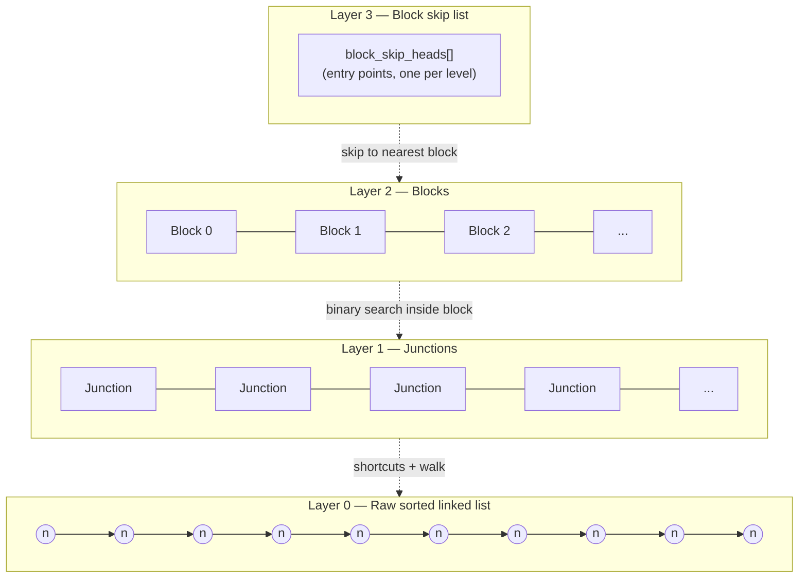
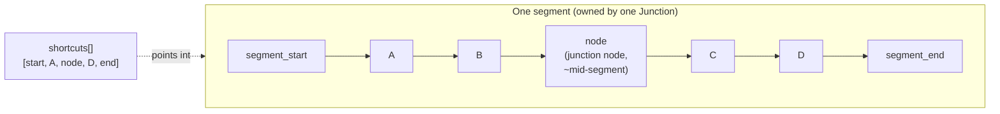
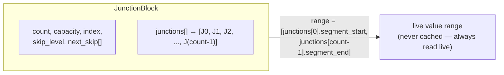
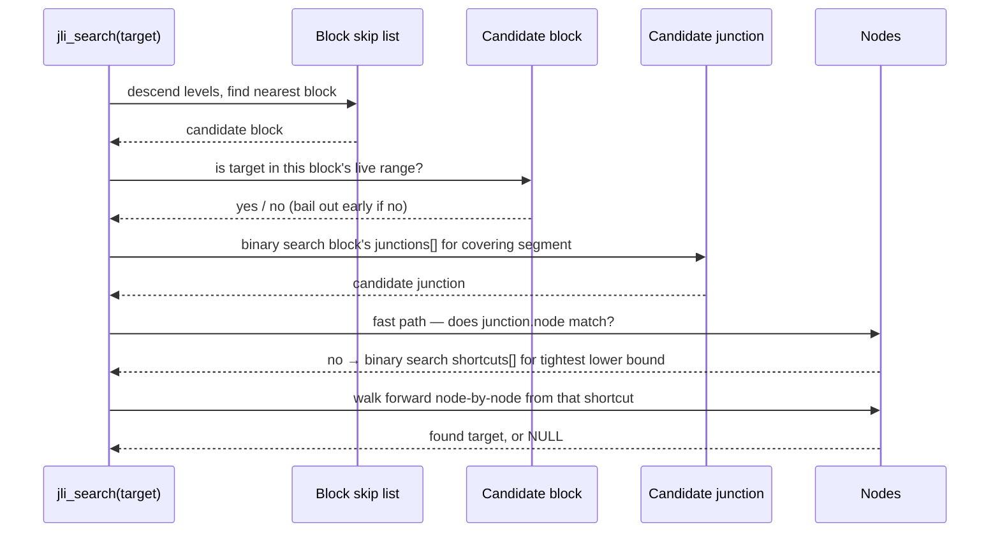
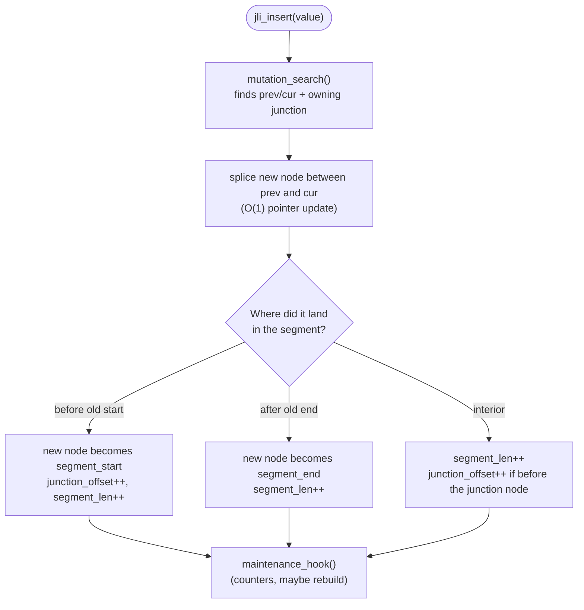
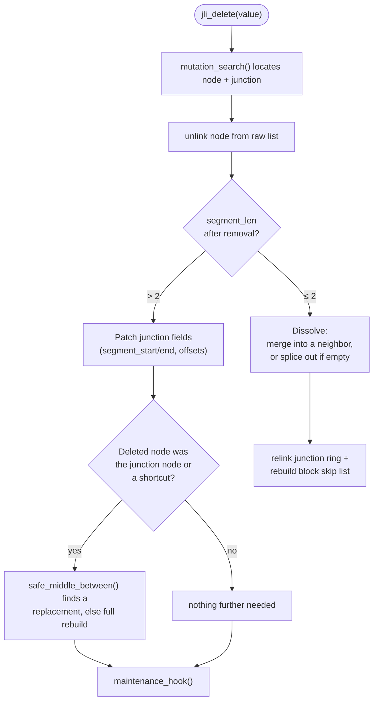
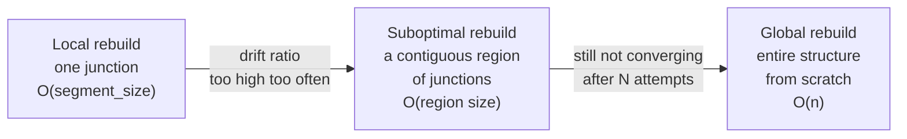

# The Junction-Linked List (JLI)

A reference explanation of the data structure implemented in `jli_v8_1.c`,
covering its layout, how search/insert/delete work, and how it keeps
itself balanced over time.

---

## 1. The problem it's solving

A plain sorted **singly linked list** gives you cheap O(1) insert/delete
once you know *where* to splice, but O(n) search — you have to walk from
the head every time.

An **array** or a **flat skip list** gives you fast O(log n) search, but
maintaining per-node positions/indices during insert or delete is
expensive — an insert in the middle can force you to shift or re-index
everything after it.

JLI's idea: keep the data in an ordinary linked list, but lay a
**two-level index** on top of it — junctions over segments, and blocks
over junctions — so you get search performance close to a skip list,
while insert/delete stay cheap splices *plus* small, boundable local
patch-ups (never a global re-index).

---

## 2. The three layers



| Layer | Structure | Role |
|---|---|---|
| 0 | `Node` singly linked list | The actual sorted data. Only place values physically live. |
| 1 | `Junction` | Describes one **segment** (a run of ~`segment_size` nodes): its start/end pointer, a distinguished "junction node" near the middle, and a small sorted array of **shortcut** pointers into the segment. |
| 2 | `JunctionBlock` | Groups a run of consecutive junctions (up to `block_hard_max`) so the top-level index has far fewer, coarser entries. |
| 3 | Block skip list | A classic randomized skip list, but its "nodes" are whole blocks, not individual keys. Gets you to the right block in expected O(log #blocks). |

---

## 3. Anatomy of a Junction



- `segment_start` / `segment_end` — first/last node of the segment.
- `node` — the "junction node": nominally sits near the segment's
  midpoint, and doubles as an extra probe point.
- `junction_offset` — `node`'s position within the segment (used to
  tell how far it has drifted off-center after edits).
- `shortcuts[]` — a small sorted array of pointers *into* the segment
  (always includes `segment_start` at index 0 and `segment_end` at the
  end), sized to `K` entries. Enables a binary search within the
  segment before falling back to pointer-chasing.

Shortcut positions aren't picked arbitrarily — `plan_shortcut_offsets()`
lays them out by repeated bisection (like the first few levels of a
binary search tree flattened into an array), so each new shortcut
subdivides the *largest remaining gap* first.

---

## 4. Anatomy of a Block

A `JunctionBlock` just holds a contiguous run of `Junction*` pointers:



Its value range is **never stored** as a cached min/max — it's always
read live off its first and last junction's segment boundaries. That
means in-place edits to those junctions can never leave a block's range
stale.

---

## 5. Search walkthrough



Roughly:

1. **Block skip list** narrows to one of `num_blocks` blocks in expected
   `O(log num_blocks)`.
2. **Binary search within the block** finds the junction whose segment
   should contain `target` — `O(log block_size)`.
3. **Binary search the junction's shortcuts**, then **walk** the
   remaining few nodes by hand — `O(log K + segment_size / K)`.

So total expected search cost is roughly:

```
O( log(num_blocks) + log(block_size) + log(K) + segment_size / K )
```

— logarithmic in the number of blocks/junctions, plus a small bounded
walk inside one segment.

---

## 6. Insert / Delete

Both start with `mutation_search()`, which is `jli_search()`'s cousin —
it returns not just a match/no-match, but the exact splice point
(`prev`, `cur`) *and* the owning junction/block, so the caller never has
to search again.



Key point: an interior insert does **not** touch `shortcuts[]` at all —
they're left slightly stale on purpose. Rebuilding them costs O(segment
size); deferring that cost until maintenance decides it's actually
worth it keeps individual inserts O(1).

Delete is the mirror image, with one extra wrinkle: if a segment shrinks
to ≤ 2 nodes, it's **dissolved** — merged into a neighboring junction
(or spliced out entirely if empty) rather than kept as a needlessly
tiny segment.



---

## 7. Staying balanced: the three maintenance tiers

Repeated inserts/deletes gradually push segments out of shape — too
big, too small, or with the junction node no longer near the middle.
JLI fixes this with three tiers, cheapest first, each escalating only
if the one below it can't keep up:



| Tier | Trigger | What it does |
|---|---|---|
| **Local** | Every `local_interval` mutations | For each junction, check if its junction node has drifted more than `t_j` from the true midpoint (`should_rebuild`); if so, re-run `build_shortcuts()` on just that one junction. |
| **Suboptimal** | Every `sub_interval` mutations | Scan every junction's `segment_len` against the target `segment_size`. Junctions whose drift exceeds `soft_pct`/`hard_pct` get grouped into contiguous regions and **repartitioned** into fresh, evenly-sized segments. |
| **Global** | Hard-drift ratio too high, or suboptimal rebuilds aren't converging after `min_suboptimal_events_before_global` attempts | Throw away all junctions and blocks; rebuild everything from the raw sorted list in one O(n) pass. |

This is the structure's core trade-off: instead of paying a little bit
on *every* mutation to stay perfectly indexed (like a balanced tree), it
lets imperfection accumulate and pays it down in occasional, bounded
bursts — while the escalation ladder guarantees it can never drift so
far that only a full rebuild will do.

---

## 8. Summary of complexities

| Operation | Typical cost | Notes |
|---|---|---|
| Search | `O(log(num_blocks) + log(block_size) + log(K) + segment_size/K)` | Effectively logarithmic + a small bounded walk |
| Insert (no rebuild triggered) | `O(log(...))` to locate + `O(1)` splice | Shortcuts left stale until maintenance |
| Delete (no dissolve) | Same as insert | |
| Delete (dissolve) | `O(segment_size)` | Rare — only when a segment shrinks to ≤ 2 nodes |
| Local rebuild | `O(segment_size)` | Amortized over `local_interval` mutations |
| Suboptimal rebuild | `O(region size)` | Amortized over `sub_interval` mutations |
| Global rebuild | `O(n)` | Rare escape hatch |
